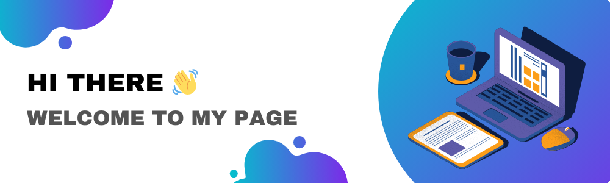

## My Experience
I am a junior web developer. I have done freelance work with my friends.
Feel free to check out our [website](https://flf-freelance.netlify.app/).

I have experience working with a team as well as individually as a freelancer.
I developed and co-designed this [website](https://quickresponseplumbing.ca/) for a local plumbing business.

If you'd like to check out some of my other work. This is my [portfolio](https://www.alejandrocastro.dev)

<!--
**alejo2198/alejo2198** is a ✨ _special_ ✨ repository because its `README.md` (this file) appears on your GitHub profile.

Here are some ideas to get you started:

- 🔭 I’m currently working on ...
- 🌱 I’m currently learning ...
- 👯 I’m looking to collaborate on ...
- 🤔 I’m looking for help with ...
- 💬 Ask me about ...
- 📫 How to reach me: ...
- 😄 Pronouns: ...
- ⚡ Fun fact: ...
-->
